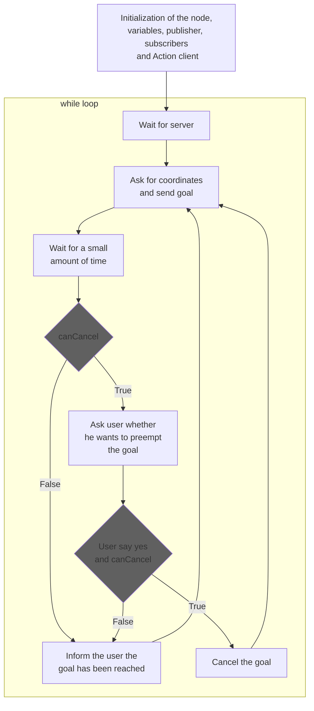
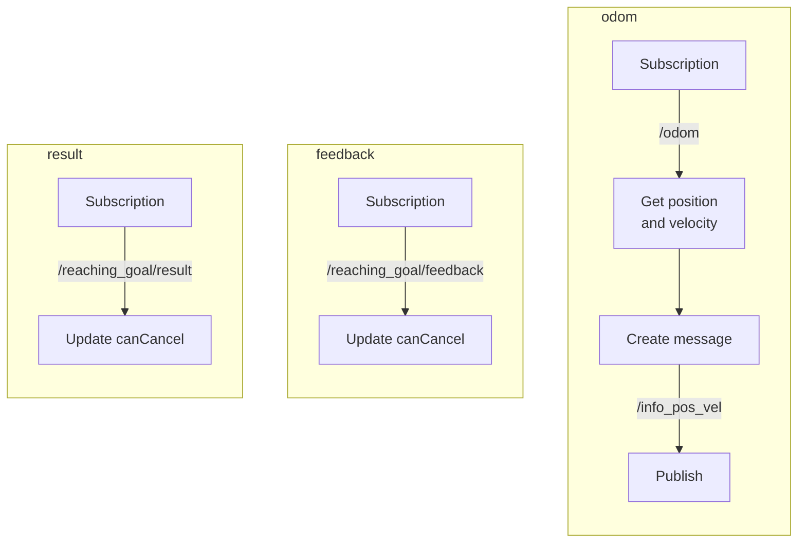

# Assignment report
## The objective  
The assignment consists in the implementation of the logic to make a robot move in a 3D space in ROS. This is done in the *Gazebo* environment and the user has to provide a target by terminal to make the robot go to the selected point. Some of the code was provided in the first place, so the necessary implementations were:
- (a) A node that implements an action client, allowing the user to set a target (x, y) or to cancel it. Try to use the feedback/status of the action server to know when the target has been reached. The node also publishes the robot position and velocity as a custom message (x,y, vel_x, vel_z), by relying on the values published on the topic /odom;
- (b) A service node that, when called, returns the coordinates of the last target sent by the user;
- (c) Another service node thatsubscribes to the robot’s position and velocity (using the custom message) and implements a server to retrieve the distance of the robot from the target and the robot’s average speed;
- A launch file to start the whole simulation. Use a parameter to select the size of the averaging window of node (c)
## Structure of the code
There are 6 python scripts inside this repository. A brief explanation of those follow:
- `go_to_point_service.py`: It is a service node, that make the robot go straight to the target;
- `wall_follower.py`: Service node that make the robot avoid the obstacles found in the path for reaching the target. When a wall is found, the robot rotates until he has a path clear of the obstacle. This makes the robot circumnavigate the obstacles it finds on its way;
- `bug_as.py`: In this script the action server is implemented. This is the script that calls the other two nodes just listed: it makes the robot go in a straight line so that it reaches a target as long as there are no obstacles. When an obstacle is found, `wall_follower.py` logic takes action;
- `client.py`: This is the node that implements the action client, such that the user can set the desired goal. It is even possible to cancel the coordinates just set in every moment, as long as the robot has not reched the target, yet. The robot position and velocity are also published by this node, as a custom message of type `Info`. A flowchart of this particular node is present in the following section;
- `goal_service.py`: This is a service node that, when called, prints the last goal set by the user;
- `info_service.py`: This is a service node that, when called, prints the distance from the robot to the target and the average linear velocity of the robot. This one is computed by making the mean value of `window_size` samples of velocities, that is a global parameter set in the launch file.
<a/>  
A launch file has been created, to launch the simulation and the 6 nodes all together. For the `client.py` node, a new *lxterminal* is created to be used as user interface.
Also, in the launch file the global parameters are set.


## Flowchart of `client.py`




## Install and run the code
In order to install the package, inside the ros workspace in the src folder clone the repository:
```
    git clone https://github.com/danielerialdi/assignment_2_2023
```
then in a terminal we run the command:
```
    roscore
```
and in the root directory of the ros workspace we compile, using the command:
```
    catkin_make
```
The scripts should all be executable, but in case they were not this can be resolved by the command:
```
chmod -x
```
followed by the script name.  
It is possible now to go inside the package directory and launch the simulation, via:
```
    roslaunch assignment_2_2023 assignment1.launch
```
A new *lxterminal* terminal will appear; there it will be possible to set the goal for the robot.

## Possible improvements
Some ideas to make the simulator better:
- Make the goal visible in the arena once the user sets it;
- Restrict the possible input of the goal, by checking the boundaries of the arena and the presence of obstacles. Only rechable points should be a possible goal;
- Make the `wall_follower.py` "smarter": now the robot turns on itself without considering in which direction the goal is, but just trying to avoid the obstacle;
- Instead of taking a single goal, the robot could take an array of coordinates, such that the user could choose a path, instead of just the final goal.
