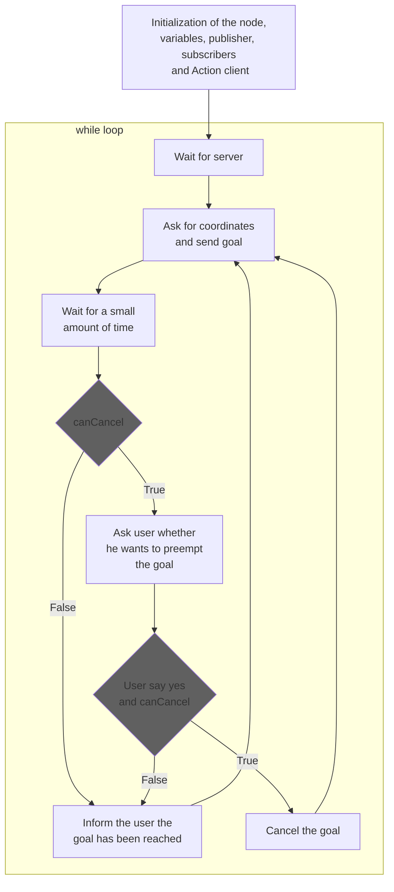
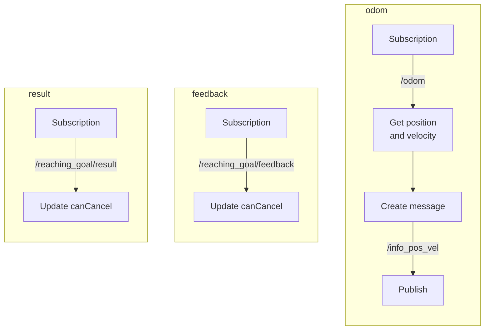

# Assignment report
In this assignment ...

## Flowchart

```mermaid
%%{ init: { 'flowchart': { 'curve': 'basis' } } }%%
flowchart TB
    classDef grey fill:#606060
    Init["Initialization of the node,\nvariables, publisher, subscribers\n and Action client"]
    Init -->  WaitServer["Wait for server"]
subgraph while["while loop&nbsp;&nbsp;&nbsp;&nbsp;&nbsp;&nbsp;&nbsp;&nbsp;&nbsp;&nbsp;&nbsp;&nbsp;&nbsp;&nbsp;&nbsp;&nbsp;&nbsp;&nbsp;&nbsp;&nbsp;&nbsp;&nbsp;&nbsp;&nbsp;&nbsp;&nbsp;&nbsp;&nbsp;&nbsp;&nbsp;&nbsp;&nbsp;&nbsp;&nbsp;&nbsp;&nbsp;&nbsp;&nbsp;&nbsp;&nbsp;&nbsp;&nbsp;&nbsp;&nbsp;&nbsp;&nbsp;&nbsp;&nbsp;&nbsp;&nbsp;&nbsp;&nbsp;&nbsp;&nbsp;&nbsp;&nbsp;&nbsp;&nbsp;&nbsp;&nbsp;&nbsp;&nbsp;&nbsp;&nbsp;"]
    direction TB
        WaitServer --> User1["Ask for coordinates\n and send goal"]
        User1 --> Delay["Wait for a small\namount of time"]
        Delay --> CanCancel{canCancel}:::grey
        CanCancel --True--> User2["Ask user whether\nhe wants to preempt\nthe goal"] 
        CanCancel --False--> Message["Inform the user the\ngoal has been reached"]

        User2 -->User3{User say yes\nand canCancel}:::grey
        User3 --False-->Message
        User3 --True-->GoalCancel["Cancel the goal"]
        GoalCancel-->User1
        Message-->User1
end
```

```mermaid
%%{ init: { 'flowchart': { 'curve': 'basis' } } }%%
flowchart TB
    classDef grey fill:#606060
    subgraph odom["odom&nbsp;&nbsp;&nbsp;&nbsp;&nbsp;&nbsp;&nbsp;&nbsp;&nbsp;&nbsp;&nbsp;&nbsp;&nbsp;&nbsp;&nbsp;&nbsp;&nbsp;&nbsp;&nbsp;&nbsp;&nbsp;&nbsp;&nbsp;&nbsp;&nbsp;&nbsp;&nbsp;&nbsp;&nbsp;&nbsp;"]
        direction TB
        SubOdom["Subscription"] --"/odom"-->Odom1["Get position\nand velocity"]
        Odom1 --> Pub1["Create message"]
        Pub1--"/info_pos_vel"-->Publish
        end


    subgraph feedback["feedback&nbsp;&nbsp;&nbsp;&nbsp;&nbsp;&nbsp;&nbsp;&nbsp;&nbsp;&nbsp;&nbsp;&nbsp;&nbsp;&nbsp;&nbsp;&nbsp;&nbsp;&nbsp;&nbsp;&nbsp;&nbsp;&nbsp;&nbsp;&nbsp;&nbsp;&nbsp;&nbsp;&nbsp;&nbsp;&nbsp;"]
        direction TB
        SubFeedback["Subscription"] --"/reaching_goal/feedback"--> Fb1["Update canCancel"]
        end

    subgraph result["result&nbsp;&nbsp;&nbsp;&nbsp;&nbsp;&nbsp;&nbsp;&nbsp;&nbsp;&nbsp;&nbsp;&nbsp;&nbsp;&nbsp;&nbsp;&nbsp;&nbsp;&nbsp;&nbsp;&nbsp;&nbsp;&nbsp;&nbsp;&nbsp;&nbsp;&nbsp;&nbsp;&nbsp;&nbsp;&nbsp;"]
        direction TB    
        SubResult["Subscription"] --"/reaching_goal/result"--> Fb2["Update canCancel"]
        end
```
