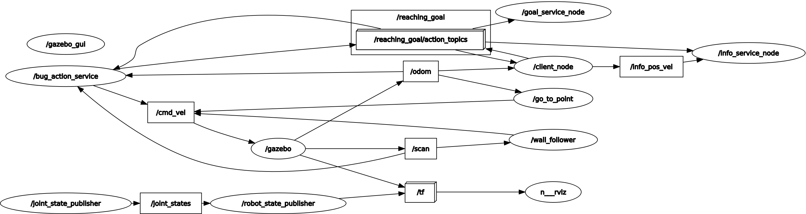
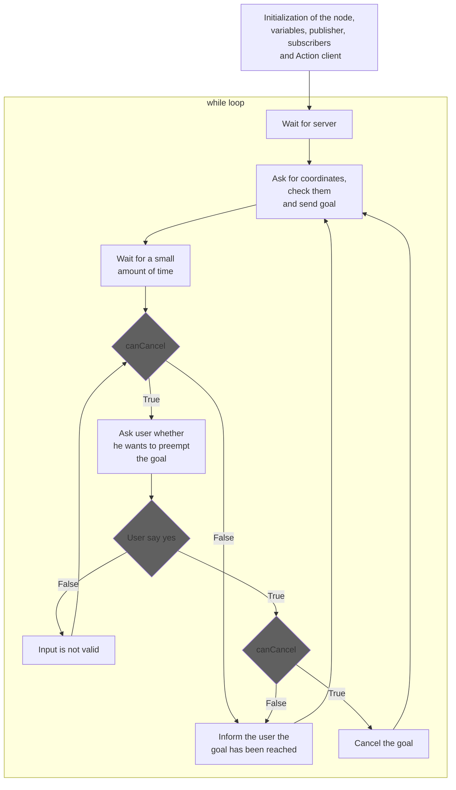
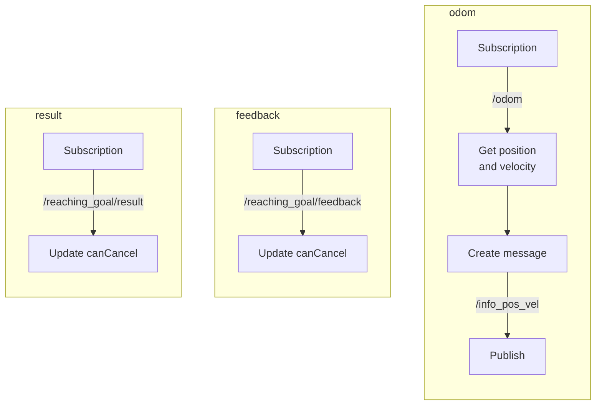

# Assignment report
## The objective  
The assignment consists in implementing the logic to move a robot in a 3D space using ROS. The robot moves in the *Gazebo* environment while the user provides the target location using the terminal. Some of the code has been provided in the first place and the requirements are the following.
> - (a) A node that implements an action client, allowing the user to set a target (x, y) or to cancel it. Try to use the feedback/status of the action server to know when the target has been reached. The node also publishes the robot position and velocity as a custom message (x,y, vel_x, vel_z), by relying on the values published on the topic /odom.
> - (b) A service node that, when called, returns the coordinates of the last target sent by the user.
> - (c) Another service node thatsubscribes to the robot’s position and velocity (using the custom message) and implements a server to retrieve the distance of the robot from the target and the robot’s average speed.
> - A launch file to start the whole simulation. Use a parameter to select the size of the averaging window of node (c).

## Structure of the code
There are 6 python scripts inside this repository. A brief explanation of those follows.
- `go_to_point_service.py`: The service node that makes the robot go straight to the target.
- `wall_follower.py`: >The service node that makes the robot avoid the obstacles found in the path for reaching the target. When a wall is found, the robot rotates until it has a straight path, clear of the obstacle. This makes the robot circumnavigate the obstacles that it finds on its way.
- `bug_as.py`: The action server is implemented in this script. It also calls the other two nodes mentioned above: it makes the robot go in a straight line so that it reaches a target as long as there are no obstacles. When an obstacle is found, `wall_follower.py` logic takes action.
- `client.py`: This is the node implementing the action client, such that the user can set the desired goal. The user can eventually cancel the current target at any time, as long as the robot has not reached the target yet. The robot position and velocity are published by this node on the topic `/info_pos_vel`, as a custom message of type `Info`; the data needed to build the custom message are obtained by subscribing the topic `/odom`. A flowchart of this particular node is available in the following section.
- `goal_service.py`: This is a service node that, when called, prints the last goal set by the user. This information is taken from the topic `/reaching_goal/goal`.
- `info_service.py`: This is a service node that, when called, prints the distance from the robot to the target and the average linear velocity of the robot. The latter is computed by making the mean value of `window_size` samples of velocities, that is a global parameter set in the launch file. The information needed are taken from the topic `/info_pos_vel`, that are published by the script `client.py`.


A launch file has been created to run the simulation including all the 6 nodes. The `client.py` node, is run by mean of the <em>lxterminal</em> to avoid mixing the user interactivity with the logs.
Also, in the launch file, the global parameters are set.  


The ROS generated graph for the nodes and the topics is shown below:



Now we can look at the structure of the `client.py` code.

## Flowchart of `client.py`




## Install and run the code
In order to install the package, clone the repository inside the src folder of the ros workspace
```
    git clone https://github.com/danielerialdi/assignment_2_2023
```
Run the following command
```
    roscore
```
Compile the cloned files using the following command from the root directory:
```
    catkin_make
```
It is, of course, necessary to ensure (`ls -la`) and eventually set the executable attribute on the scripts
```
    chmod +x filename.py
```
It is possible now to go inside the package directory and launch the simulation, using:
```
    roslaunch assignment_2_2023 assignment1.launch
```
A new *lxterminal* terminal will be opened. From this terminal the user will be asked to write the target coordinates.

## Possible improvements
Some ideas to improve the simulator:
- Make the goal visible in the *Gazebo* arena once the user sets it;
- Restrict the possible inputs of the goal, by checking the boundaries of the arena and the presence of obstacles. Only reachable locations should be allowed as goals;
- Make the `wall_follower.py` "smarter": the current implementation always turns the robot in the same direction instead of considering the most convenient one to reach the target;
- Instead of instructing the robot with a single goal, it could take an array of goals, such that the user could provide a path, instead of just the final goal.
